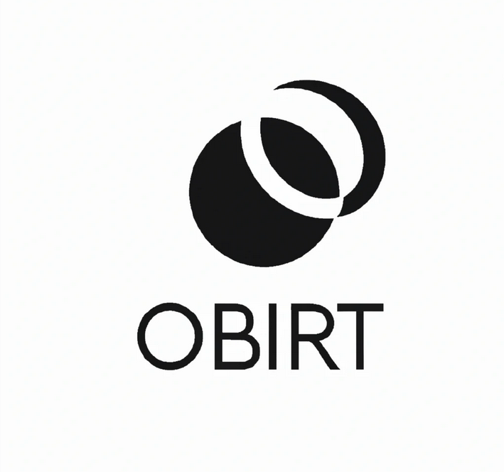
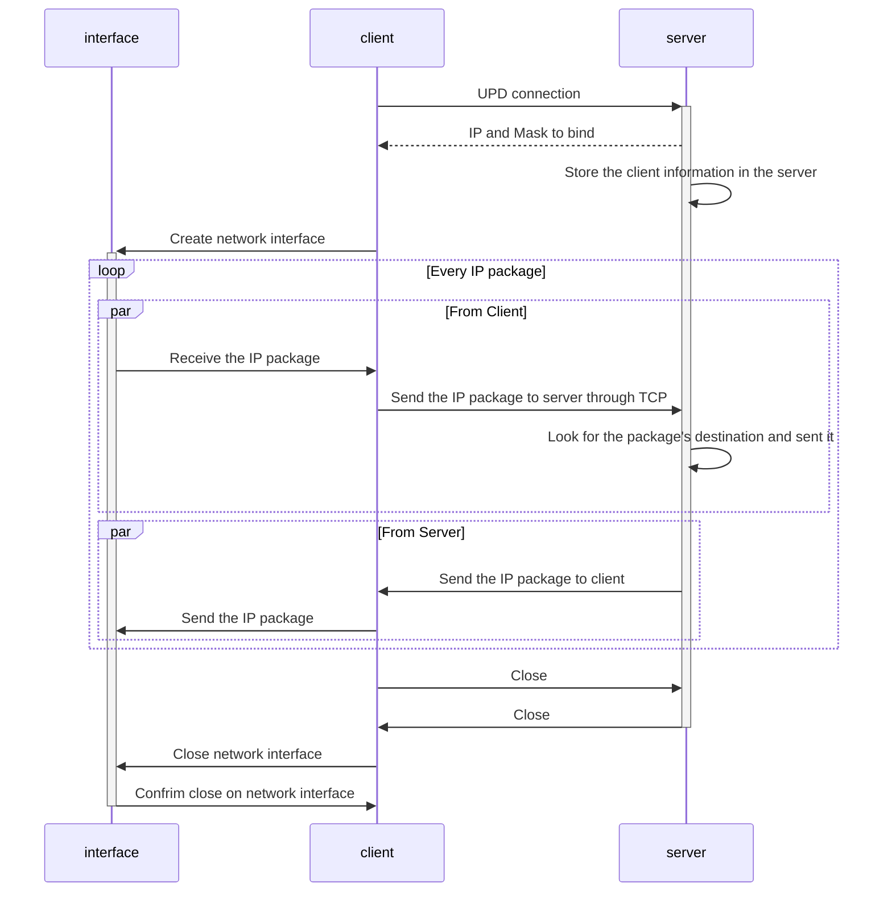

  

<h3 align="center">A simple VPN</h3>

```mermaid
sequenceDiagram
participant interface
participant client
participant server
client ->>+ server: UPD connection
server -->> client: IP and Mask to bind
server ->> server: Store the client information in the server
client ->>+ interface: Create network interface
loop Every IP package
    par From Client
    interface ->> client: Receive the IP package
    client ->> server: Send the IP package to server through TCP
    server ->> server: Look for the package's destination and sent it
    end
    par From Server
    server ->> client: Send the IP package to client
    client ->> interface: Send the IP package
    end
end
client ->> server: Close
server ->>- client: Close
client ->> interface: Close network interface
interface ->>- client: Confrim close on network interface

```

. . .

