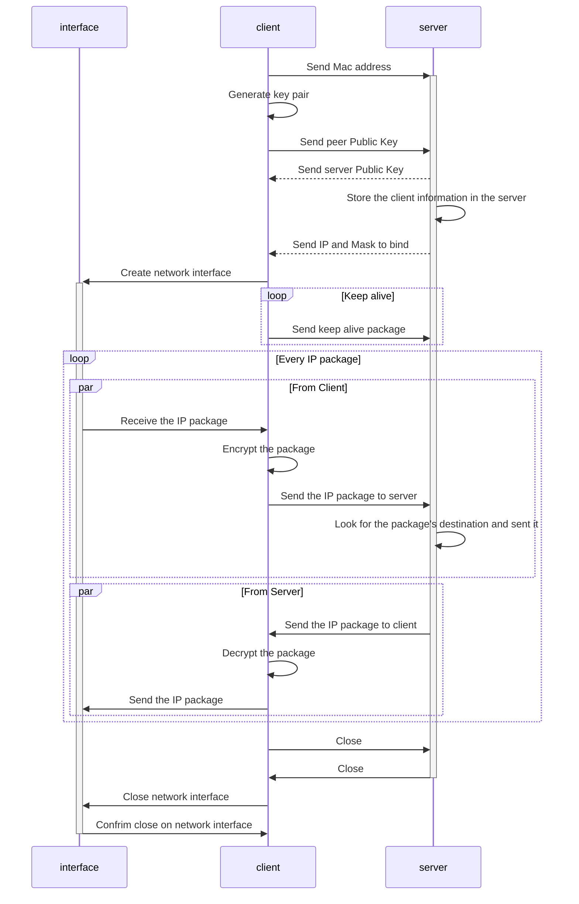

<p align="center">
  
</p>

<h3 align="center">A simple VPN</h3>

# How to use

Start a server

```sh
obirt server
```

Start a client using `obirt.henrybarreto.dev` as server.

```sh
obirt client obirt.henrybarreto.dev
```

## The Client

The client connects to a server, send all IP packages received by the network interface and injecting the package what was routed by the server.



## The Server

The server receives all IP packages from the peers connected, and redirect it to the destination registed on it.

<p align="center">. . .</p>
